# Setting up Microsoft Speech To Text

## One of three steps required to setup SpeechToTranslated

### Github

Sign up to www.github.com, which is free. This is where you can get a copy of the SpeechToTranslated program.

Navigate to the web page http://www.github.com/PunkUnicorn/SpeechToTranslated

Click on 'Actions' (see picture)

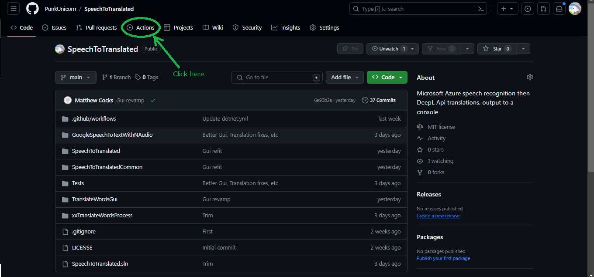

Select the top version (see picture)

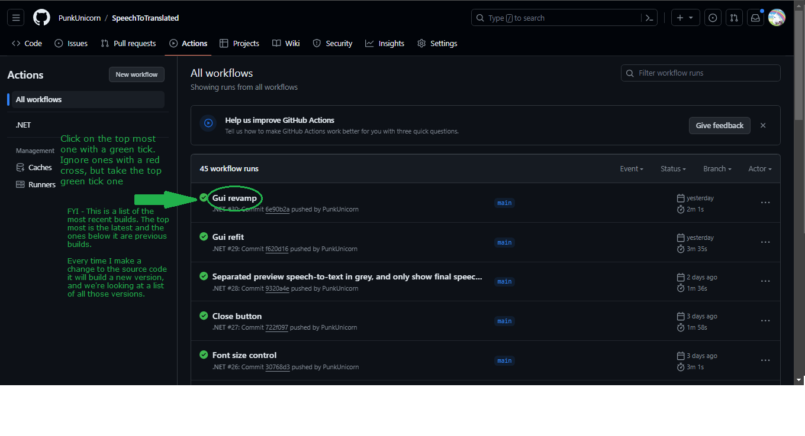

Then download the build results (see picture)

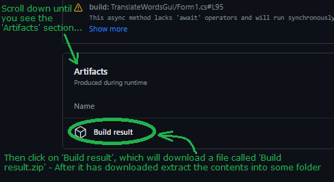

Unzip the file 'Build result.zip' into some folder.

Find the file called 'appsettings.json' because next we'll generate keys then we'll paste the keys into this file.

## Two of three steps required to setup SpeechToTranslated

### Azure - Speech Services

SpeechToTranslated uses Microsoft Azure "Speech Services".

Sign up with Microsoft Azure.

After you've signed up, go to the Azure Portal and search for "Speech Services", then click "Create new". There is a free tier of service, which is OK for a few hours of usage per month.

Creating a new Speech Service will bring up this screen. That will bring you to this screen. 

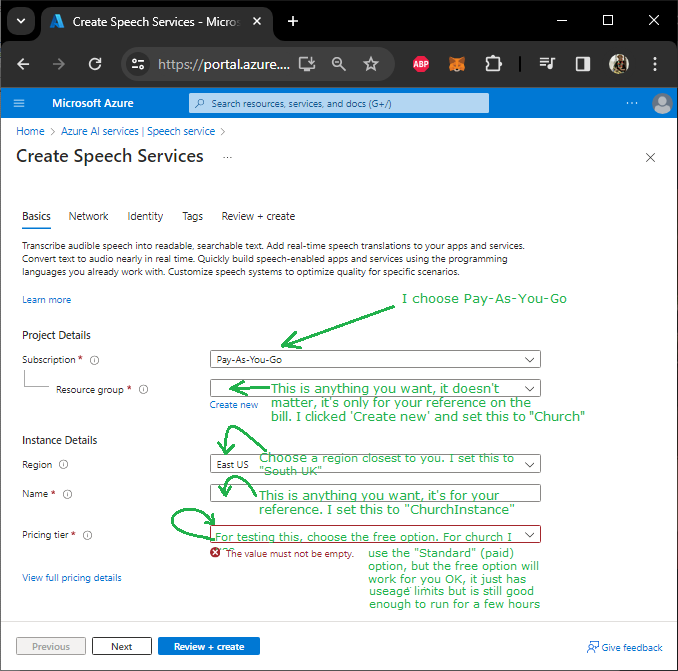

Click through until you've created your subscription. The defaults are fine past the above screen.

Then after your Speech Service subscription has been created select the overview of your new service, you will see something similar to this:

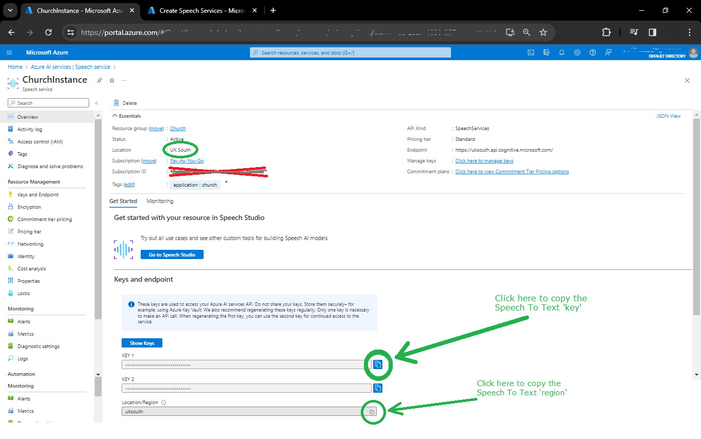

Take a copy of your key and region.

Now find the file called 'appsettings.json' from the 'Build Results.zip'. Make sure you only replace the three dots and the quotation marks are still there. So your key (and region) are enclosed by the double quotation marks.

Copy and paste the key and 'region' into the appsettings file:

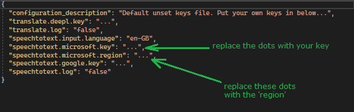

## Three of three steps required to setup SpeechToTranslated

### DeepL API - translation service

SpeechToTranslated uses DeepL API, a translation web service.

Sign up for DeepL Api, but watch out! There are many types of DeepL subscription but we want 'DeepL Api' (see picture)

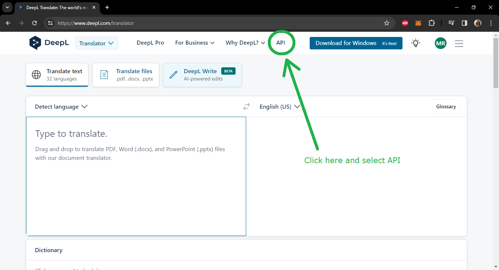

Click 'sign up for free':

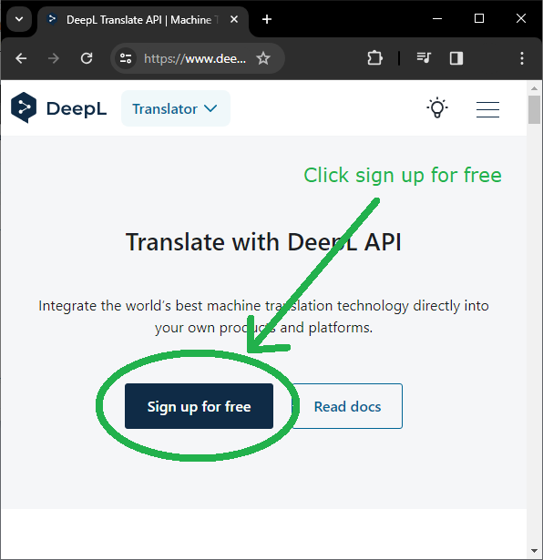

Choose the free plan:

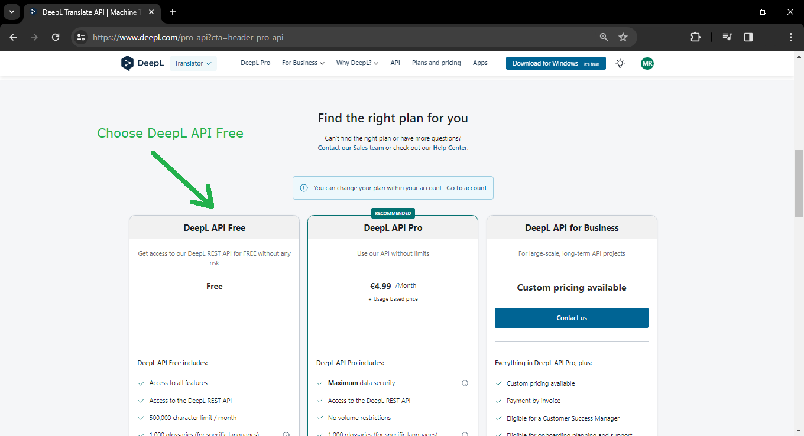

After you've signed up for the free plan, go to your account settings to get your DeepL key

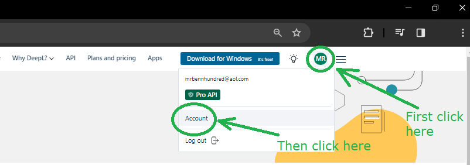

Then copy your key and paste it into the file 'appsettings.json'. Make sure you only replace the three dots and the quotation marks are still there. So your key is enclosed by the double quotation marks.

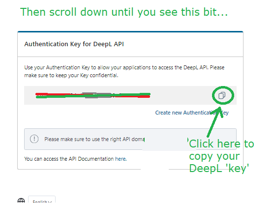

